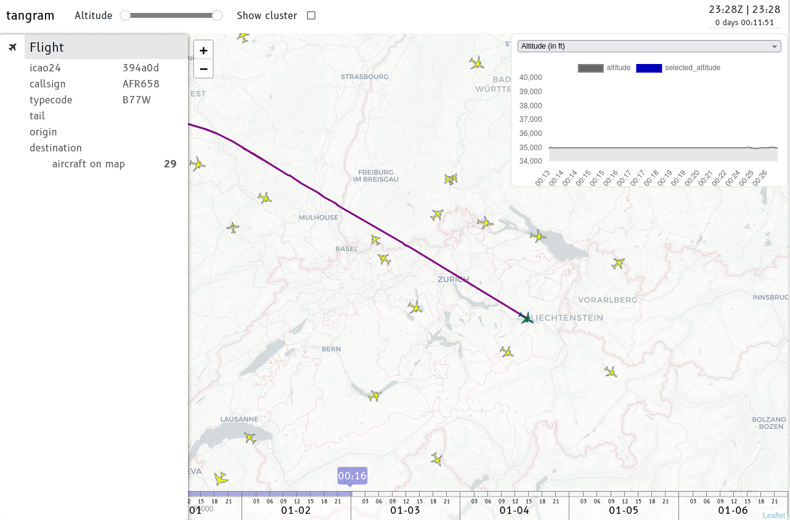

# Tangram

Tangram is an open framework that aggregates and processes ADS-B and Mode S surveillance data for real-time analysis. It provides a flexible plugin architecture where users can easily implement custom analyzers for their specific needs.

The system consists of a JavaScript frontend and a Python backend built with FastAPI. The backend efficiently aggregates data from multiple receiver streams and exposes a WebSocket interface, enabling real-time data visualization and analysis in the browser-based frontend.


## Quick start

1. Install [just](https://github.com/casey/just) - a command project-sepcific runner

2. Install [podman](https://podman.io/docs/installation) - a container runtime

3. create a `.env` file from the template:

  ```shell
  cp .env.example .env
  ```

  Set the `JET1090_SOURCE` to the source of your ADS-B data. For example, you can use an example web socket provided by us: `ws://...:9876/40128@EHRD`

  ```shell
  JET1090_SOURCE=ws://...:9876/40128@EHRD
  ```

4. pull and run a Redis container, this is used for message caching between different services:

  ```shell
  just pc-redis
  ```


5. build the tagram container:

  ```shell
  just pc-build
  ```

6. run the tangram container:

  ```shell
  just pc-run
  ```

7. Visualize the live data:

  Visit <http://localhost:2024> in your browser.


## Results

Here is a screenshot of the tool running in real-time:




## Funding

This project is currently funded by the Dutch Research Council (NWO)'s Open Science Fund, **OSF23.1.051**: https://www.nwo.nl/en/projects/osf231051.

## History

In 2020, @junzis and @xoolive published a paper [Detecting and Measuring Turbulence from Mode S Surveillance Downlink Data](https://research.tudelft.nl/en/publications/detecting-and-measuring-turbulence-from-mode-s-surveillance-downl-2) on how real-time Mode S data can be used to detect turbulence.

Based on this method, @MichelKhalaf started developing this tool as part of his training with @xoolive in 2021, which was completed in Summer 2022. After that, the project was then lightly maintained by @xoolive and @junzis, while we have been applying for funding to continue this tool.

And in 2023, we received funding from NWO to continue the development of this tool. With this funding, @emctoo from [Shintech](https://www.shinetechsoftware.com) was hired to work alongside us on this open-source project.
