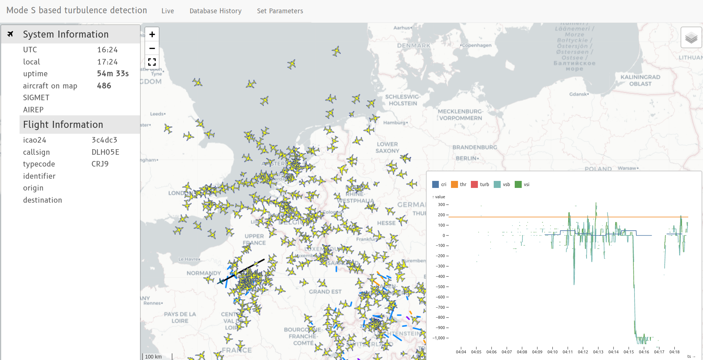

# tangram

Tangram is an open framework that aggregates Mode S data feed for detecting turbulence.

## Installation

1. You must have at least one Mode S feed

1. Checkout following repositories, and make sure they are all in the same directory: 

    1. Checkout traffic repository: https://github.com/xoolive/traffic
    1. Checkout atmlab repository: https://github.com/xoolive/atmlab
    1. Checkout this repository: https://github.com/open-aviation/tangram

1. install poetry: https://python-poetry.org/docs/#installation

1. install tangram using:

```sh
cd tangram
poetry install
```

## Running 


### Setup

```sh
# If need be...
mkdir -p ~/.config/systemd/user

# Copy the files to systemd configuration folder
cp systemd/* ~/.config/systemd/user/
```

### Prepare

```sh
systemctl --user enable decoder@delft
systemctl --user enable aggregator
systemctl --user enable turbulence
```


### Run

```sh
systemctl --user start decoder@delft
systemctl --user start aggregator
systemctl --user start turbulence
```

### Send Data

The raw feed can be sent to the server from your receiver as follows:

```sh
nc 127.0.0.1 [modesbeast_port] | nc -u [server_ip] [port_number]
```


### Check Status

```sh
systemctl --user status decoder@delft
systemctl --user status aggregator
systemctl --user status turbulence
```

## Results

Here is an example of the tool running in real time:

